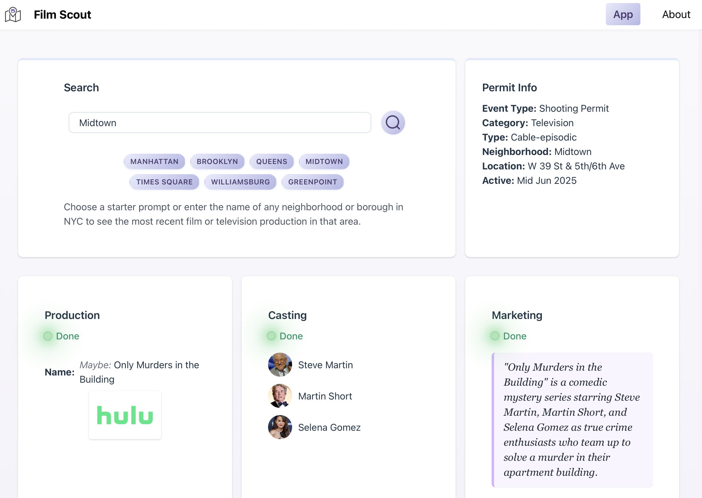

# Film Scout Frontend



## Overview

Film Scout is a web app that provides information about filming activities across New York City. The platform combines data from NYC's Mayor's Office of Media & Entertainment, OpenAI's Developer Platform and Google Images to provide an engaging experience to help users discover film and TV production locations and details.

## Key Features

- **Interactive Dashboard**: Browse and filter film production permits
- **Production Details**: View comprehensive information about productions, including cast and crew
- **Location Tracking**: Find filming locations by borough, neighborhood, and area (such as Time Square or Central Park)
- **News Integration**: Get the latest updates about film productions and locations

## Tech Stack

- **React 19**: Modern UI library for component-based architecture
- **Vite 6**: Next-generation frontend build tooling
- **React Router 7**: Client-side routing and navigation
- **TailwindCSS**: Utility-first CSS framework for styling
- **Framer Motion**: Animation library for interactive elements
- **Node.js/Express**: Backend API integration

## Project Structure

```
film-scout-frontend/
├── src/                   # Application source code
│   ├── App.jsx            # Main application component
│   ├── Dashboard.jsx      # Main dashboard interface
│   ├── Navbar.jsx         # Navigation component
│   ├── News.jsx           # News feature component
│   ├── Cards/             # Card components for dashboard
│   ├── components/        # Reusable UI components
│   ├── context/           # React context providers
│   ├── utils/             # Utility functions and API clients
│   └── cloud-functions/   # Cloud functions for data processing
├── public/                # Static assets
├── scripts/               # Build and utility scripts
├── Dockerfile             # Docker configuration
├── vite.config.js         # Vite configuration
├── tailwind.config.js     # Tailwind CSS configuration
└── package.json           # Project dependencies and scripts
```

## Getting Started

### Prerequisites

- Node.js 18+ (LTS) or Docker
- npm or yarn package manager

### Installation

1. Clone the repository:
   ```bash
   git clone https://github.com/asentic-co/film-scout-frontend.git
   cd film-scout-frontend
   ```

2. Install dependencies:
   ```bash
   npm install
   ```

3. Set up environment variables:
   - Create a `.env` file based on `.env.example`
   - Required variables:
     - `VITE_API_URL`: Backend API URL
     - `VITE_NEWS_API_URL`: News service API URL
     - `VITE_ENVIRONMENT`: Development or production

4. Start the development server:
   ```bash
   npm run dev
   ```

### Docker Setup

For containerized development:

```bash
docker-compose up frontend
```

## Deployment

### Production Build

```bash
npm run build
```

This generates optimized files in the `dist` directory.

### Deployment Options

- **Vercel**: Configure with `vercel.json` (recommended)
- **Docker**: Use the provided Dockerfile for containerization
- **Static Hosting**: Deploy the `dist` folder to any static hosting service

### Vercel Deployment

Vercel is the recommended platform for deploying this React application. The project is already configured with a `vercel.json` file for seamless deployment.

1. **Sign up for Vercel**: Create an account at [vercel.com](https://vercel.com)

2. **Install the Vercel CLI**:
   ```bash
   npm install -g vercel
   ```

3. **Login to Vercel**:
   ```bash
   vercel login
   ```

4. **Deploy the project**:
   ```bash
   vercel
   ```

5. **For production deployment**:
   ```bash
   vercel --prod
   ```

The `vercel.json` configuration includes:
- Vite as the framework
- Custom build and dev commands
- SPA routing setup with proper rewrites
- Output directory configuration

## Data Architecture

Film Scout works with NYC film permit data that includes:

- Production details (name, type, contact information)
- Filming locations (streets, boroughs, neighborhoods)
- Filming schedules (start/end dates and times)
- Production categories (Film, TV, Commercial, etc.)

## Feature Highlights

### Dashboard Interface

The dashboard provides an intuitive interface for exploring film productions with:

- Search functionality for productions and locations
- Detailed information cards for each production
- Cast and crew details when available
- Marketing and promotional information

### News Integration

The News feature aggregates information from various sources:

- Production-specific updates
- Location-based news
- Featured stories about NYC film industry
- Curated image galleries

## Contributing

1. Fork the repository
2. Create a feature branch: `git checkout -b feature-name`
3. Commit changes: `git commit -am 'Add new feature'`
4. Push to branch: `git push origin feature-name`
5. Submit a pull request

## License

MIT

## Acknowledgments

- NYC Mayor's Office of Media & Entertainment for data
- NYC Open Data platform
- React and Vite communities